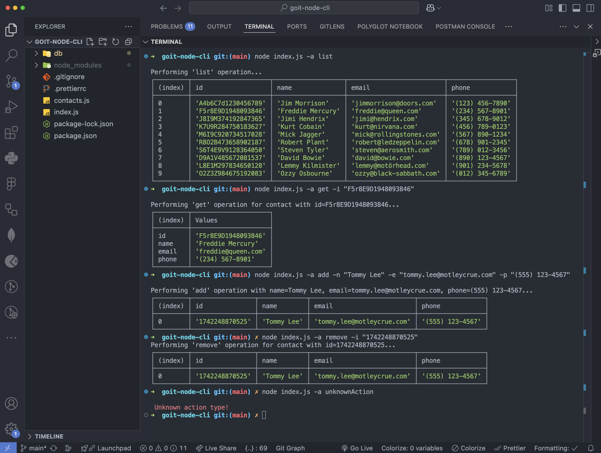

Домашнє завдання. Тема 2. Створення консольних додатків

Крок 1

Створи репозиторій з назвою goit-node-cli, склонуй та ініціалізуй в ньому проєкт
за допомогою команди npm init. Встанови як залежність проєкту пакет commander В
корінь проєкту помісти файли з папки src

Крок 2

У файл contacts.js зроби імпорт модулів fs (у версії, яка працює з промісами -
fs/promises) і path для роботи з файловою системою. Створи змінну contactsPath і
запиши в неї шлях до файлу contacts.json. Для складання шляху використовуй
методи модуля path. Додай асинхронні функції для роботи з колекцією контактів. У
функціях використовуй модуль fs та його методи readFile() і writeFile().
Відповідні функції мають повертати необхідні дані за допомогою оператора return.
Вивід в консоль в написаних функціях здійснюватись не повинен. Зроби експорт
створених функцій.

// contacts.js

/\*

- Розкоментуй і запиши значення
- const contactsPath = ; \*/

async function listContacts() { // ...твій код. Повертає масив контактів. }

async function getContactById(contactId) { // ...твій код. Повертає об'єкт
контакту з таким id. Повертає null, якщо контакт з таким id не знайдений. }

async function removeContact(contactId) { // ...твій код. Повертає об'єкт
видаленого контакту. Повертає null, якщо контакт з таким id не знайдений. }

async function addContact(name, email, phone) { // ...твій код. Повертає об'єкт
доданого контакту (з id). }

Крок 3

Зроби імпорт функцій з файла contacts.js в файл index.js. Далі використовуй
готову функцію invokeAction(), яка отримує тип виконуваної дії і необхідні
аргументи. Функція має викликати відповідний метод з файлу contacts.js,
передаючи йому необхідні аргументи. Результат роботи викликаної функції слід
вивести в консоль.

Крок 4

Запусти команди в терміналі і переконайся, що код працює належним чином.

# Отримуємо і виводимо весь список контактів у вигляді таблиці (console.table)

node index.js -a list

# Отримуємо контакт по id і виводимо у консоль об'єкт контакту або null, якщо контакту з таким id не існує.

node index.js -a get -i 05olLMgyVQdWRwgKfg5J6

# Додаємо контакт та виводимо в консоль об'єкт новоствореного контакту

node index.js -a add -n Mango -e mango@gmail.com -p 322-22-22

# Видаляємо контакт та виводимо в консоль об'єкт видаленого контакту або null, якщо контакту з таким id не існує.

node index.js -a remove -i qdggE76Jtbfd9eWJHrssH

Критерії прийому

Створено репозиторій з домашнім завданням Посилання на репозиторій надіслане
ментору на перевірку Код відповідає технічному завданню проєкту У коді немає
закоментованих ділянок коду Проєкт коректно працює з актуальною LTS-версією Node

Формат здачі

Домашня робота містить посилання на вихідні файли (посилання на репозиторій з
кодом). Прикрiплений файл репозиторію у форматi zip. ☝ ВАЖЛИВО Переглянь
Iнструкцію щодо завантаження робочого файлу з репозиторію на Github

Формат оцінювання

Оцiнка вiд 0 до 100

Градацiя балів

Загальний максимум - 100 балiв

Крок 2 — 60 балів

Успішний імпорт модулів fs/promises і path - 10 балів Правильне використання
методів модуля path для створення шляху - 10 балів Коректна реалізація функції
listContacts, яка повертає масив контактів - 10 балів Коректна реалізація
функції getContactById, яка повертає контакт за ID або null, якщо контакт не
знайдено - 10 балів Коректна реалізація функції removeContact, яка видаляє
контакт за ID і повертає видалений об'єкт або null, якщо контакт не знайдено -
10 балів Коректна реалізація функції addContact, яка додає новий контакт і
повертає доданий об'єкт з ID - 10 балів

Крок 3 — 30 балів

Успішний імпорт усіх необхідних функцій із файлу contacts.js у index.js - 10
балів Правильне використання функції invokeAction() для виклику методів з
contacts.js з відповідними аргументами - 10 балів Коректне виведення результату
функції invokeAction()в консоль - 10 балів

Крок 4 — 10 балів

Успішний запуск і перевірка роботи всіх функцій у терміналі - 10 балів

За що можуть бути зняті бали в рамках перевiрки кожного з некоректно
реалізованих пунктiв, зазначених вище:

критична помилка - мінус 5 балів незначна помилка - мінус 2 бали

Особливостi прийняття домашнього завдання

Критерії прийняття домашнього завдання є обов’язковою умовою оцінювання
домашнього завдання ментором. Якщо якийсь з критеріїв НЕ виконано, ДЗ
відправляється ментором на доопрацювання без оцінювання.

Якщо вам “тільки уточнити”😉 або ви “застопорилися” на якомусь з етапів
виконання— звертайтеся до ментора у Slack)

🚨 УВАГА!!

У вас є можливість обрати підхід до виконання та можливого доопрацювання
домашнього завдання:

Задовольнитися першою отриманою оцінкою (звісно ж, якщо вона вище прохідного
бала), Намагатися отримати вищий бал шляхом можливого послідуючого доопрацювання
роботи у відповідності з фідбеком ментора. Обраний підхід до виконання ДЗ за
бажанням студент зазначає у коментарі в полі для здачі домашнього завдання. За
відсутності коментаря ментор дотримується першого підходу й виставляє отриману
оцінку.

📌 Якщо є помилки або недоліки виконання, кількість балів на кожному етапі
зменшується пропорційно до наявних помилок на розсуд ментора.

Відправляйте ДЗ на перевірку, коли зроблено все можливе, оскільки кількість
спроб здачі завдання впливає на отриманий бал!

За кожну наступну спробу після другої (тобто з третьої) максимальна можлива
кількість балів зменшується на 5.

Таким чином:

1 спроба: максимальна кількість балів – 100, 2 спроба: максимальна кількість
балів – 100, 3 спроба: максимальна кількість балів – 95, 4 спроба: максимальна
кількість балів – 90, 5 спроба: максимальна кількість балів – 85, тощо Критерії
оцінювання робіт у магістратурі GoIt Neoversity

Пам'ятайте, що виконання всіх вимог та рекомендацій є важливим для успішного
завершення домашнього завдання.

Бажаємо успіху у роботі!

### Результат виконаного ДЗ

